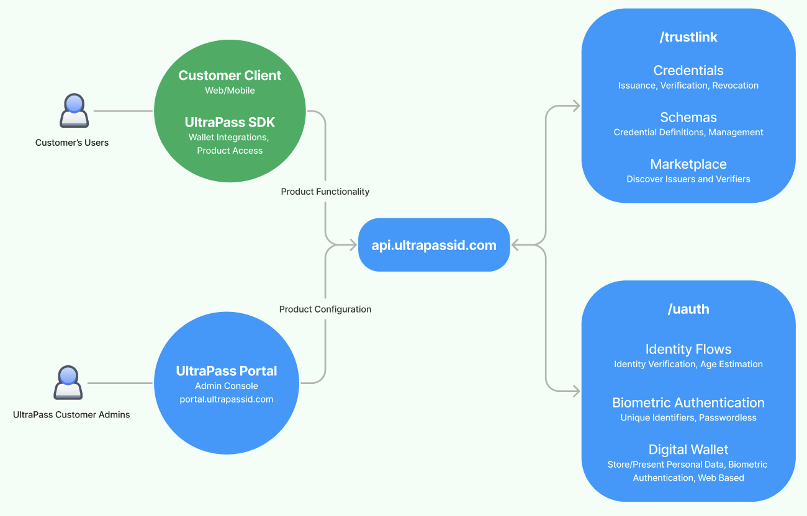

# API Reference


UltraPass makes it easy to authenticate and receive verified data from people and organizations in just a few API calls. 

Use **TrustLink** to issue, verify, and manage credentials.

Use **UAuth** to authenticate users and empower them to control their own data. 

# Architecture

{: .fs-6 .fw-300 }